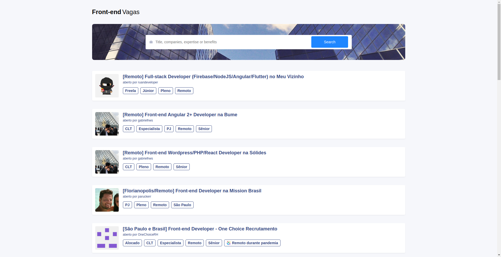

<h1 align="center"> FrontendBR Vagas </h1>

  
  

<h2><a href="https://frontendbr-vagas.netlify.app/">Demo</a> </h2>

## Features

- ⚛ **React**
- 💅 **Styled Components**
- 💅 **Styled System**
- ⚛️ **Atomic Design**
- 📚 **Storybook**

## Getting started

1. Clone this repo using `https://github.com/julianosirtori/github-jobs.git`
2. Move to the appropriate directory: `cd github-jobs`. 
3. Run `yarn` to install dependencies. 
4. Run `yarn start` to see the example app at `http://localhost:3000`.
